### 一、作用

DRF中的**序列化器**作用：用来进行**序列化**或**反序列化操作(数据校验)**的一个工具。

### 二、序列化器定义

```python
# serializers模块，是drf框架定义关于序列化器内容
from rest_framework import serializers

class HeroInfoSimpleSerializer(serializers.Serializer):
    id = serializers.IntegerField()
    hname = serializers.CharField()

# 针对BookInfo模型类对象，定义一个序列化器，这个序列化器专门用来操作BookInfo对象数据的
class BookInfoSerializer(serializers.Serializer):
    id = serializers.IntegerField()
    btitle = serializers.CharField()
    bpub_date = serializers.DateField()
    bread = serializers.IntegerField()
    bcomment = serializers.IntegerField()
    is_delete = serializers.BooleanField()
    image = serializers.ImageField()

    # 隐藏的关联字段heros —— 记录关联的从表HeroInfo多个对象
    # (1)、序列化为关联对象的主键值，read_only=True表明此属性/字段只参与序列化操作
    # heros = serializers.PrimaryKeyRelatedField(read_only=True, many=True)
    # (2)、序列化为关联对象的__str__方法返回的结果
    # heros = serializers.StringRelatedField(many=True)
    # (3)、使用自定义的关联对象模型类序列化器进行序列化
    # heros = HeroInfoSimpleSerializer(many=True)

# 针对HeroInfo模型类定义序列化器
class HeroInfoSerializer(serializers.Serializer):
    # 主键隐藏属性
    id = serializers.IntegerField()
    # 固有属性
    hname = serializers.CharField()
    hgender = serializers.IntegerField()
    hcomment = serializers.CharField()
    is_delete = serializers.BooleanField()
    # 关联属性/字段
    # (1)、序列化为关联对象的主键值，read_only=True表明此属性/字段只参与序列化操作
    # hbook = serializers.PrimaryKeyRelatedField(read_only=True)
    # (2)、序列化为关联对象的__str__方法返回的结果
    # hbook = serializers.StringRelatedField()
    # (3)、使用自定义的关联对象模型类序列化器进行序列化
    # hbook = BookInfoSerializer()
```

> 针对BookInfo模型类对象，定义一个序列化器，这个序列化器专门用来操作BookInfo对象数据的
>
> (1)、明确操作的目标数据 —— 模型类
>
> (2)、继承自Serializer
>
> (3)、定义和模型类"同名"类属性，类型一一对应的形式，来确定参与序列化的模型类属性
>
> (4)、只要模型类中存在的属性，哪怕是隐藏的都可以在序列化器中定义出来
>
> (5)、针对一个模型类，可以定义多个序列化器实现不同的序列化业务需求

### 三、序列化操作

序列化完整流程：`模型类对象 --> 字典 --> json`。

序列化器完成了`模型类对象 --> 字典`的序列化过程。

#### 1、序列化操作标准执行流程

- (1)、获取目标数据(一个或多个模型类对象)
  - 一个：`book = BookInfo.objects.get(pk=1)`
  - 多个：`books = BookInfo.objects.all()`
- (2)、实例化序列化器对象，通过`instance`传入目标数据(通过`many=True`指明目标数据为多个对象)
  - 一个：`bs = BookInfoSerializer(instance=book)`
  - 多个：`bs = BookInfoSerializer(instance=books, many=True)`
- (3)、获取序列化结果(单一对象结果为普通`dict`，多个对象结果为`OrderedDict`)
  - `bs.data`

##### 1.1、单一对象序列化

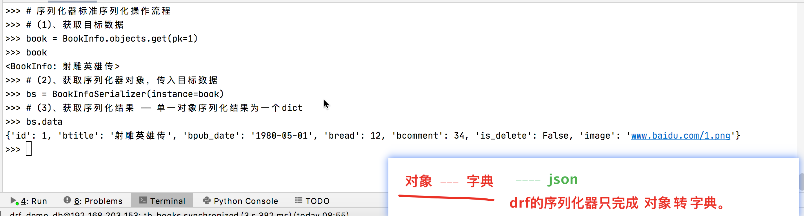

##### 1.2、多个对象序列化

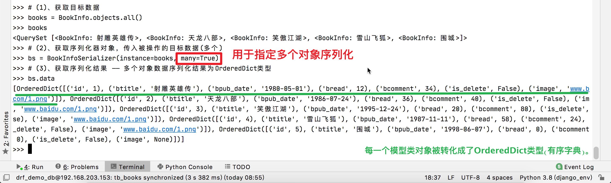

#### 2、关联对象嵌套序列化

##### 2.1、序列化从表对象的时候，嵌套序列化关联的主表对象(一个)

- (1)、关联主表对象字段，序列化为关联对象的主键值

  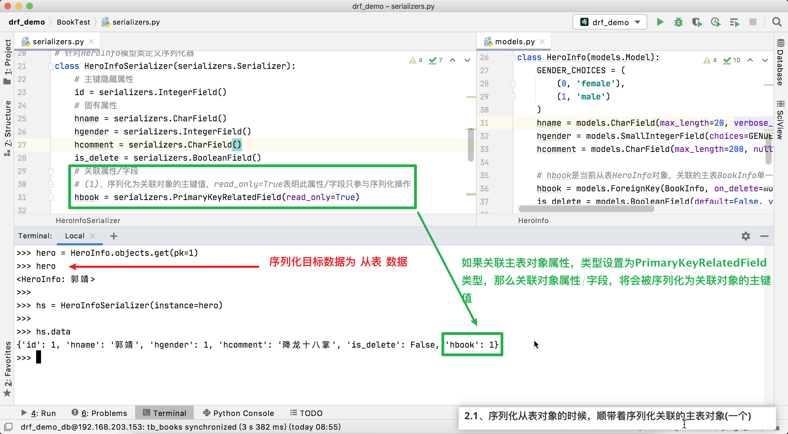

- (2)、关联主表对象字段，序列化为关联对象`__str__`方法返回的结果

  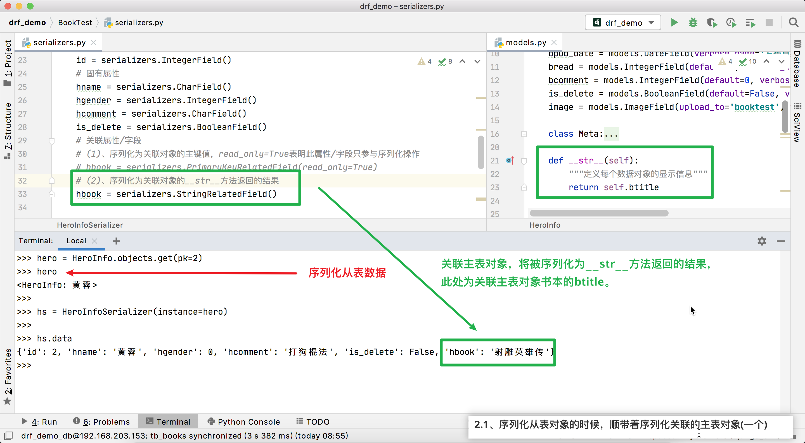

- (3)、关联主表对象字段，使用自定义的序列化器来序列化

  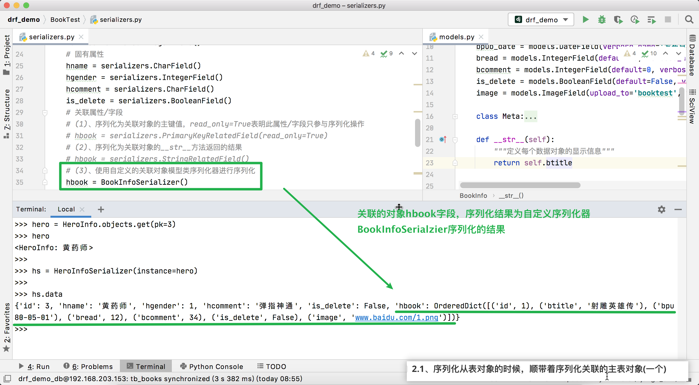

##### 2.2、序列化主表对象的时候，嵌套序列化关联的从表对象(多个)

模型类设置：<u>通过从表设置外键约束条件`related_name`来指定主表隐藏字段记录关联从表多个对象数据</u>

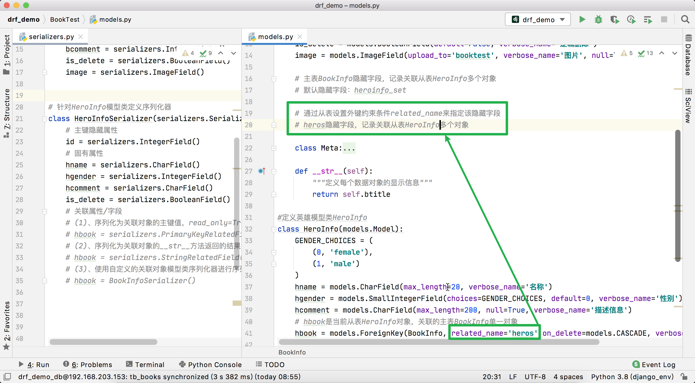

- (1)、序列化为关联对象的主键值，`read_only=True`表明此属性/字段只参与序列化操作

  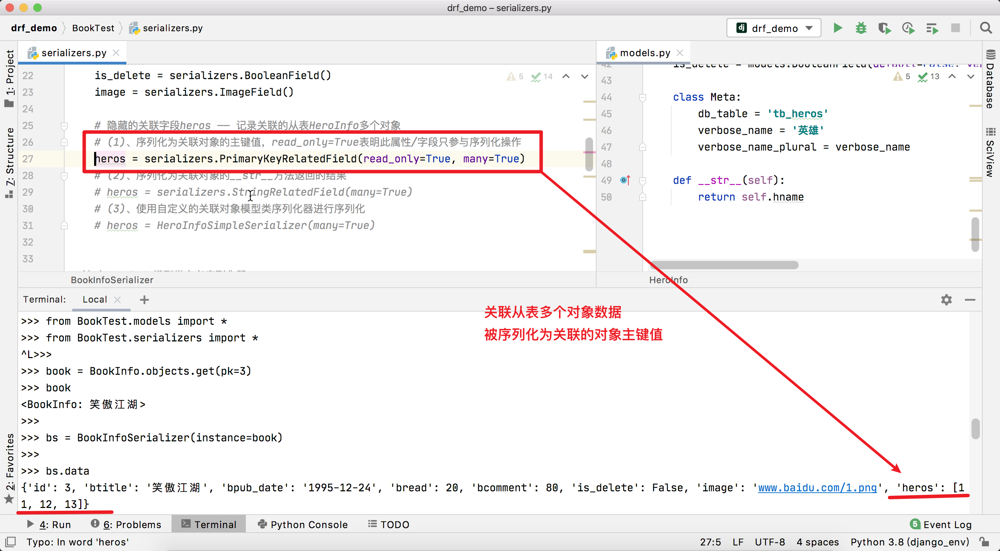

- (2)、序列化为关联对象的`__str__`方法返回的结果

  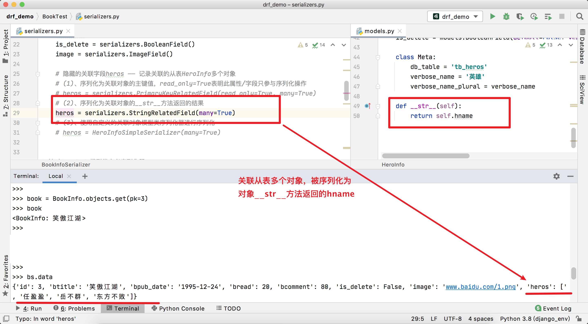

- (3)、使用自定义的关联对象模型类序列化器进行序列化

  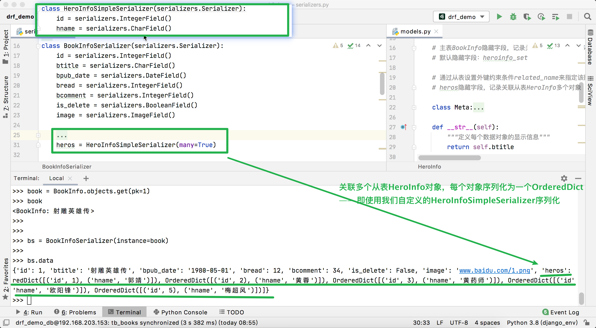

### 四、反序列化操作

反序列化操作完整流程：`json --> 字典 --> 校验 --> 新建/更新模型类对象`。

序列化器完成了`字典 --> 校验 --> 新建/更新模型类对象`部分流程。

#### 1、反序列化之标准校验流程

##### 1.1、标准流程

- (1)、获取前端传参
  - `book_info = {"btitle": "三国演义", "bpub_date": "1885-8-6"}`
- (2)、实例化序列化器对象( 通过`data`传入被校验的前端参数, 通过`partial=True`来控制部分校验/更新)
  - 必要字段，必传必校验(全校验)：`bs = BookInfoSerializer(data=book_info)`
  - 传什么字段就校验什么字段(部分校验)：`bs = BookInfoSerializer(data=book_info, partial=True)`
- (3)、启动校验步骤
  - `bs.is_valid()`：默认会以返回值`True`表示校验成功，`False`表示校验失败。
  - ` bs.is_valid(raise_exception=True)`: 校验失败，会以抛出`ValidationError`异常形式，来表达校验失败。
- (4)、获取校验结果
  - <u>当且仅当校验成功</u>，才能获取有效数据: `bs.validated_data`
  - 校验失败，获取错误信息：`bs.errors`

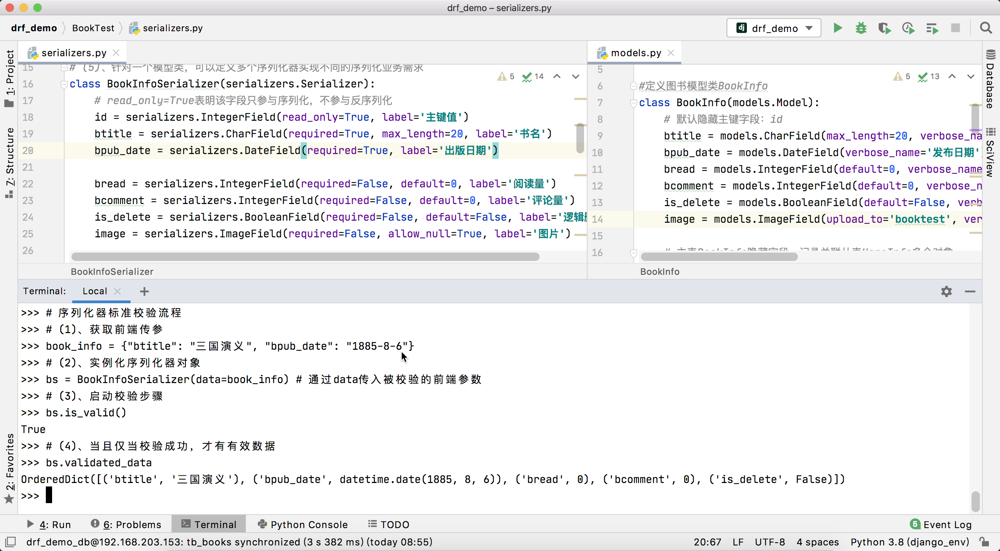

##### 1.2、自定义校验

校验步骤:

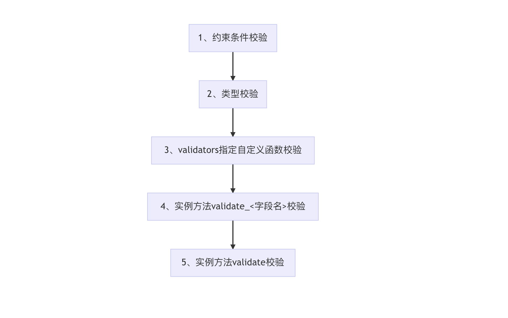

###### 1.2.1、约束条件`validators`指定校验函数

```python
def check(value):
    # 功能： 针对btitle字段，自定义一个校验函数
    # 参数：一定有一个参数value，是当前字段经过前序校验的值 —— "静态django"
    # 返回值：无

    if "django" not in value:
        # 说明校验失败 —— 抛出ValidationError异常来通知上层调用者校验失败
        raise serializers.ValidationError('这不是一本关于djangod的书')


class BookInfoSerializer(serializers.Serializer):
		# 略....
    # validators用于指定针对当前字段的多个校验函数
    btitle = serializers.CharField(label='名称', max_length=20, validators=[check])
```

###### 1.2.2、实例方法`validate_<字段名>`校验

```python
class BookInfoSerializer(serializers.Serializer):
    # 略......
    btitle = serializers.CharField(label='名称', max_length=20)

    # 自定义一个特殊名称的实例方法，来针对btitle字段进行单独校验
    # 方法名称固定格式：validate_<字段名>
    def validate_btitle(self, value):
        # 功能：针对btitle单独校验
        # 参数：value —— 当前字段经过前序校验的值
        # 返回值：经过当前校验之后的有效值
        if 'django' not in value:
            raise serializers.ValidationError('这不是一本关于django的书')

        # 一定要返回经过当前校验之后的有效值
        return value
```

###### 1.2.3、实例方法`validate`校验

```python
from rest_framework import serializers
from datetime import date

class BookInfoSerializer(serializers.Serializer):
  	# 略......
    btitle = serializers.CharField(label='名称', max_length=20)
    bpub_date = serializers.DateField(label='发布日期')

    # 终极校验函数*****
    def validate(self, attrs):
        # 功能：针对所有字段进行自定义校验
        # 参数：attrs —— 字典类型，记录了经过前序校验之后的所有字段的值： {"btitle": "精通django", "bpub_date": date(1999, 8, 7)......}
        # 返回值：一定要返回经过当前校验之后的所有字段值 —— 返回值即是最终的"有效数据"

        btitle = attrs.get('btitle')
        print('书名：', btitle)
        bpub_date = attrs.get('bpub_date')
        print('出版日期：', bpub_date)

        if 'django' not in btitle:
            raise serializers.ValidationError('这不是一本关于django的书')

        # 约定，出版日期必须大于/晚于date(2017,1,1)
        if bpub_date <= date(2017, 1, 1): # 2017年1月1日:
            raise serializers.ValidationError('出版日期必须晚于2017年1月1日')

        # 返回最终的有效数据
        return attrs
```

#### 2、反序列化之标准新建流程

反序列化操作完整流程：`json --> 字典 --> 校验 --> 新建模型类对象`。

- (1)、获取前端参数: `info = {"btitle": "精通django", "bpub_date": "2021-1-1"}`
- (2)、实例化序列化器对象：`bs = BookInfoSerializer(data=info)`
- (3)、启动校验步骤: `bs.is_valid()`
- (4)、新建/保存数据(**当且仅当校验成功**): `bs.save()`
  - `bs.save()`函数，本质上间接调用序列化器里面的`create`方法，并自动传入校验之后的有效数据，来完成数据的新建/保存动作。

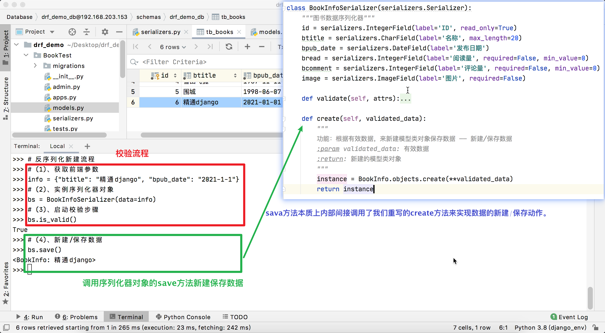

#### 3、反序列化之标准更新流程

反序列化操作完整流程：`json --> 字典 --> 校验 --> 更新模型类对象`。

- (1)、获取被更新的目标数据(模型类对象)：`book = BookInfo.objects.get(pk=6)`
- (2)、获取前端参数：`info = {"btitle": "精通django新版", "bpub_date": "2020-12-23"}`
- (3)、实例化序列化器对象: `bs = BookInfoSerializer(instance=book, data=info, partial=True)`
  - `instance`: 通过该参数指定被更新的目标数据(模型类对象)
  - `data`: 通过该参数传入用于更新的前端传来的参数
  - `partial=True`：通过设置该字段为`True`表明后续更新为部分更新(部分校验，传什么字段就校验什么字段就更新什么字段)
- (4)、启动校验步骤: `bs.is_valid()`
- (5)、更新数据(**当且仅当校验成功**)：`ba.save()`
  - `bs.save()`方法本质上间接调用了序列化器里面的`update`方法，并自动传入`instance`和校验成功之后的有效数据`validated_data`，来实现更新动作。

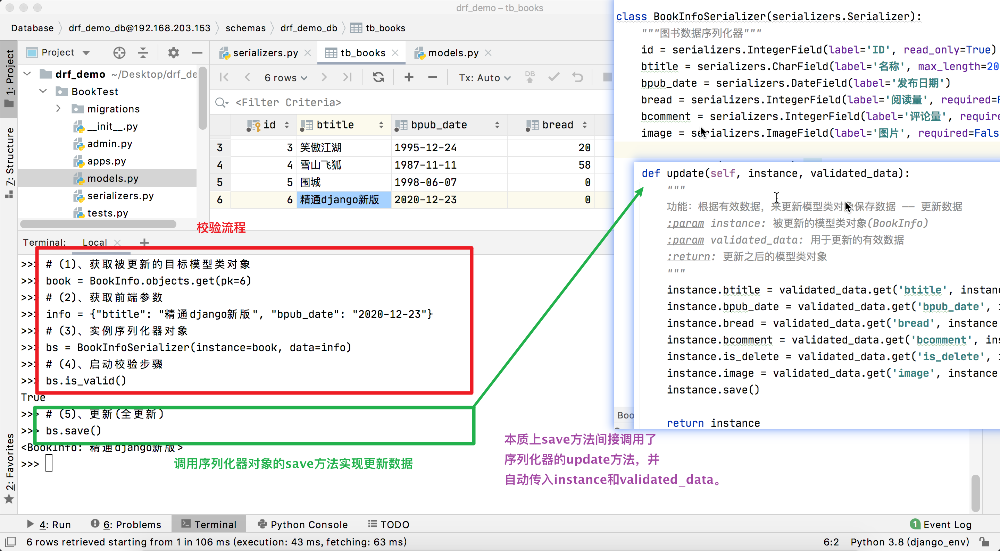

#### 4、新建流程和更新流程比对

实例化序列化器对象的时候，如果传入`instance`了，后续`save`方法表达的含义为**更新**，间接调用`update`方法实现更新逻辑。如果仅仅传入`data`了，后续`save`方法表达的含义为**新建**，间接调用`create`方法实现新建逻辑。

`save`方法实现的源码如下：

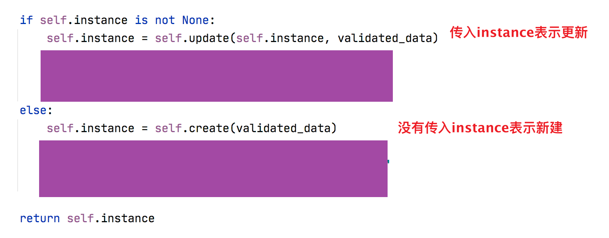

#### 5、关联字段参与反序列化校验说明

前提条件，外间关联字段设置为`PrimaryKeyRelatedField`，并通过约束条件`queryset`设置关联的模型类查询集。在反序列化过程中，前端传来关联对象的主键值，通过类型校验后，有效数据中该字段为主键值对应关联模型类对象(本质上就是根据主键值在`queryset`中进行唯一过滤得出)。

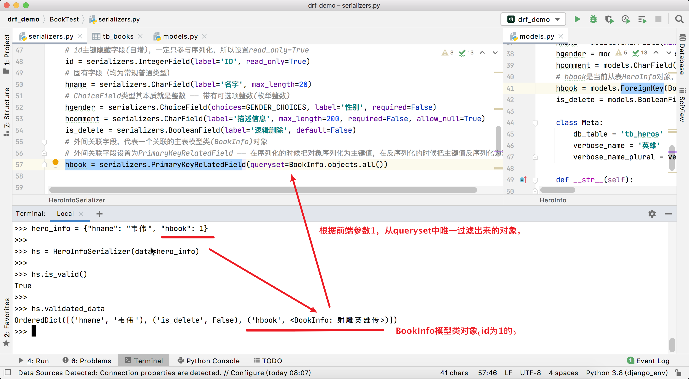